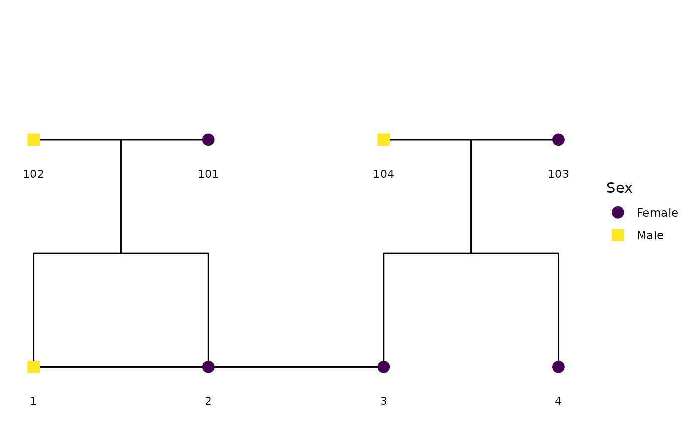

# Network tools for finding extended pedigrees and path tracing

## Introduction

This vignette showcases two key features that capitalize on the network
structure inherent in pedigrees:

1.  Finding extended families with *any* connecting relationships
    between members. This feature strictly uses a person’s ID, mother’s
    ID, and father’s ID to find out which people in a dataset are
    remotely related by any path, effectively finding all separable
    extended families in a dataset.

2.  Using path tracing rules to quantify the *amount* of relatedness
    between all pairs of individuals in a dataset. The amount of
    relatedness can be characterized by additive nuclear DNA, shared
    mitochondrial DNA, sharing both parents, or being part of the same
    extended pedigree.

### Loading Required Libraries and Data

``` r
library(BGmisc)
data(potter)
```

## Finding Extended Families

Many pedigree datasets only contain information on the person, their
mother, and their father, often without nuclear or extended family IDs.
Recognizing which sets of people are unrelated simplifies many
pedigree-related tasks. This function facilitates those tasks by finding
all the extended families. People within the same extended family have
at least some form of relation, however distant, while those in
different extended families have no relations.


Potter Family Pedigree

We will use the `potter` pedigree data as an example. For convenience,
we’ve renamed the family ID variable to `oldfam` to avoid confusion with
the new family ID variable we will create.

``` r
df_potter <- potter
names(df_potter)[names(df_potter) == "famID"] <- "oldfam"

ds <- ped2fam(df_potter, famID = "famID", personID = "personID")

table(ds$famID, ds$oldfam)
#>    
#>      1
#>   1 36
```

Because the `potter` data already had a family ID variable, we compare
our newly created variable to the pre-existing one. They match!

## Computing Relatedness

Once you know which sets of people are related at all to one another,
you’ll likely want to know how much. For additive genetic relatedness,
you can use the
[`ped2add()`](https://r-computing-lab.github.io/BGmisc/reference/ped2add.md)
function.

``` r
add <- ped2add(potter, sparse = FALSE)
```

This computes the additive genetic relatedness for everyone in the data.
It returns a square, symmetric matrix that has as many rows and columns
as there are IDs.

``` r
add[1:7, 1:7]
#>     1    2    3    4   5     6     7
#> 1 1.0 0.50 0.00 0.00 0.0 0.500 0.000
#> 2 0.5 1.00 0.00 0.00 0.0 0.250 0.000
#> 3 0.0 0.00 1.00 0.50 0.0 0.500 0.250
#> 4 0.0 0.00 0.50 1.00 0.0 0.250 0.500
#> 5 0.0 0.00 0.00 0.00 1.0 0.000 0.500
#> 6 0.5 0.25 0.50 0.25 0.0 1.000 0.125
#> 7 0.0 0.00 0.25 0.50 0.5 0.125 1.000
```

The entry in the ith row and the jth column gives the relatedness
between person i and person j. For example, person 1 (Vernon Dursley)
shares 0.5 of their nuclear DNA with person 6 (Dudley Dursley), shares
0.5 of their nuclear DNA with person 2 (Marjorie Dursley).

``` r
table(add)
#> add
#>      0 0.0625  0.125   0.25    0.5      1 
#>    788      6     94    208    164     36
```

It’s probably fine to do this on the whole dataset when your data have
fewer than 10,000 people. When the data get large, however, it’s much
more efficient to compute this relatedness separately for each extended
family.

``` r
add_list <- lapply(
  unique(potter$famID),
  function(d) {
    tmp <- potter[potter$famID %in% d, ]
    ped2add(tmp, sparse = FALSE)
  }
)
```

### Other relatedness measures

The function works similarly for mitochondrial (`ped2mit`), common
nuclear environment through sharing both parents (`ped2cn`), and common
extended family environment (`ped2ce`).

#### Computing mitochondrial relatedness

Here we calculate the mitochondrial relatedness between all pairs of
individuals in the `potter` dataset.

``` r
mit <- ped2mit(potter, sparse = FALSE)
mit[1:7, 1:7]
#>   1 2 3 4 5 6 7
#> 1 1 1 0 0 0 0 0
#> 2 1 1 0 0 0 0 0
#> 3 0 0 1 1 0 1 1
#> 4 0 0 1 1 0 1 1
#> 5 0 0 0 0 1 0 0
#> 6 0 0 1 1 0 1 1
#> 7 0 0 1 1 0 1 1
table(mit)
#> mit
#>    0    1 
#> 1082  214
```

As you can see, some of the family members share mitochondrial DNA, such
as person 2 and person 3 0, whereas person 1 and person 3 do not.

#### Computing relatedness through common nuclear environment

Here we calculate the relatedness between all pairs of individuals in
the `potter` dataset through sharing both parents.

``` r
commonNuclear <- ped2cn(potter, sparse = FALSE)
commonNuclear[1:7, 1:7]
#>   1 2 3 4 5 6 7
#> 1 1 1 0 0 0 0 0
#> 2 1 1 0 0 0 0 0
#> 3 0 0 1 1 0 0 0
#> 4 0 0 1 1 0 0 0
#> 5 0 0 0 0 1 0 0
#> 6 0 0 0 0 0 1 0
#> 7 0 0 0 0 0 0 1

table(commonNuclear)
#> commonNuclear
#>    0    1 
#> 1196  100
```

#### Computing relatedness through common extended family environment

Here we calculate the relatedness between all pairs of individuals in
the `potter` dataset through sharing an extended family.

``` r
extendedFamilyEnvironment <- ped2ce(potter, sparse = FALSE)
extendedFamilyEnvironment[1:7, 1:7]
#>      [,1] [,2] [,3] [,4] [,5] [,6] [,7]
#> [1,]    1    1    1    1    1    1    1
#> [2,]    1    1    1    1    1    1    1
#> [3,]    1    1    1    1    1    1    1
#> [4,]    1    1    1    1    1    1    1
#> [5,]    1    1    1    1    1    1    1
#> [6,]    1    1    1    1    1    1    1
#> [7,]    1    1    1    1    1    1    1
table(extendedFamilyEnvironment)
#> extendedFamilyEnvironment
#>    1 
#> 1296
```

## Subsetting Pedigrees

Subsetting a pedigree allows researchers to focus on specific family
lines or individuals within a larger dataset. This can be particularly
useful for data validation as well as simplifying complex pedigrees for
visualization. However, subsetting a pedigree can result in the
underestimation of relatedness between individuals. This is because the
subsetted pedigree may not contain all the individuals that connect two
people together. For example, if we were to remove Arthur Weasley
(person 9) and Molly Prewett (person 10) from the `potter` dataset, we
would lose the connections amongst their children.


Potter Subset Pedigree

In the plot above, we have removed Arthur Weasley (person 9) and Molly
Prewett (person 10) from the `potter` dataset. As a result, the
connections between their children are lost.

Similarly, if we remove the children of Vernon Dursley (1) and Petunia
Evans (3) from the `potter` dataset, we would lose the connections
between the two individuals.

However, this subset does not plot the relationship between spouses
(such as the marriage between Vernon Dursley and Petunia Evans), as
there are not children to connect the two individuals together yet.

``` r
subset_rows <- c(1:5, 31:36)
subset_potter <- potter[subset_rows, ]
```


